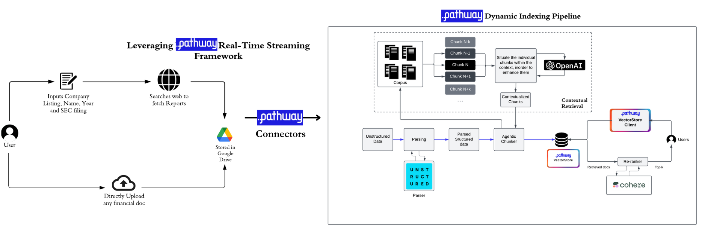
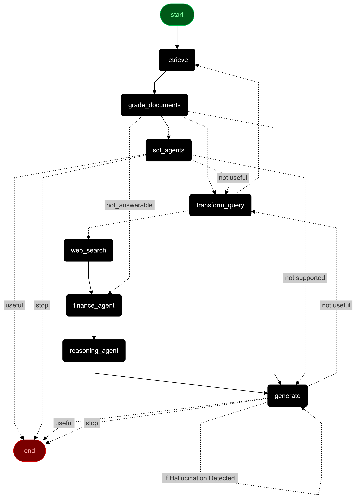
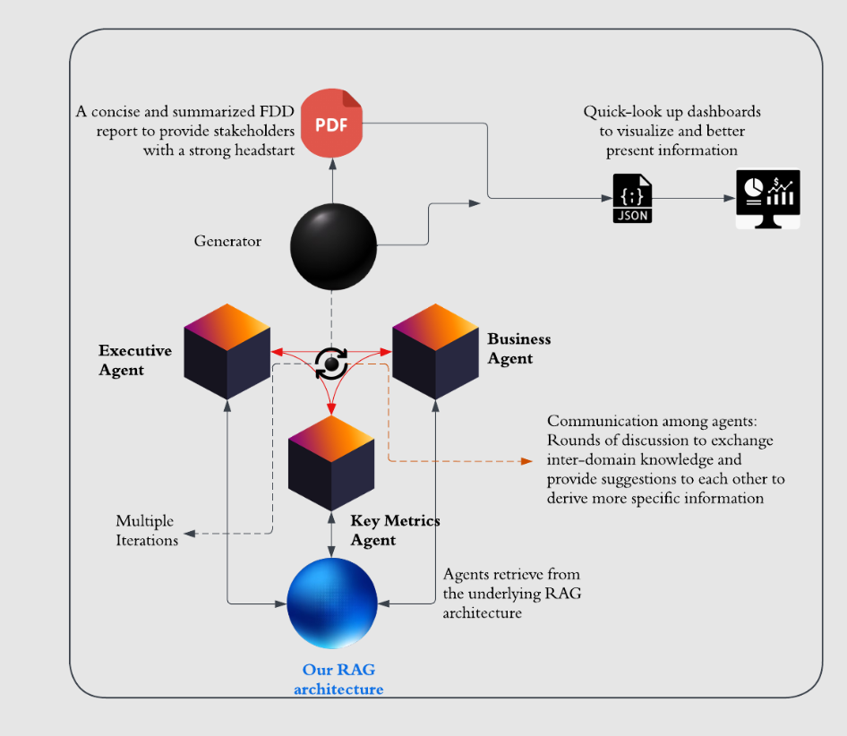

# FA3STER

This guide provides instructions for setting up and running our Agentic RAG system.

---

## Prerequisites

- **Python 3.10** (recommended)
- API keys for any necessary integrations, stored in a `.env` file
- We have provided some API keys made with a dummy account(to maintain anonymity of submission)
- Preferably a virtual environment like Miniconda.


## OPTION 1: Set up the project locally

### 1. Clone and Navigate to the Project Directory
```bash
cd FA3STER
```

### 2. Install Required Libraries
```bash
npm install
cd backend_server
pip install -r requirements.txt
pip install -r requirements2.txt
```

### 3. Configure Environment Variables
- Add the necessary API keys in a .env file in the root directory.

### 4. Navigate to the `rag` Directory
```bash
cd rag
```

### 5. Setup Google Drive Integration
Our implementation uses Google Drive to store documents, accessed via a Pathway connector.
- Upload your files for the VectorStoreServer in a Google Drive folder and provide the object ID of that folder in the `.env` file under the key `GDRIVE_FOLDER_OBJECT_ID`
- It is suggested to not upload more than 80-100 pages document in the Drive folder, we noticed that it takes a lot of time to process documents larger than that.
- Some Suggested Documents: Alphabet 10K Report 2023, Apple 10K Report 2022
- Add your Google Drive API credentials in `/backend_server/rag/credentials.json`
- Add the same credentials to `/backend_server/credentials.json`

### 7. Run the VectorStoreServer
Start the server using 
```bash
python ragServer.py
```
- The server runs in INFO logging mode by default in port `127.0.0.1:8011/`
- Note: The VectorStoreServer setup time varies based on document volume. It uses Unstructured’s High Resolution Parser with Agentic Chunking (details are available in the report). During our testing a 80 page doc (10k report) took 30 minutes on average to setup.

### 8. Run backend and web sockets port
- In another terminal, navigate to the `FA3STER/backend_server` directory
- Run `graph_websockets.py` which tunes in 'Chat Mode' for querying our robust RAG system. 
```bash
cd FA3STER/backend_server/
python graph_websockets.py
```
- In another terminal, navigate to `FA3STER/backend_server` and run `graph.py` which is for the 'Report Mode' and renders DueDiligence reports.
- It is recommended to keep the Streamlit interface open in the browser while running the frontend for smooth functionality.

```bash
cd FA3STER/backend_server/
streamlit run graph.py 
```
- **(Optional , in case you want to upload a file to the drive)** Run `sec_uploader.py` which is for the server which manages the upload of the file from local storage to Google Drive.
or inputs the Ticker name and the year and extracts it from 10K reports for the RAG Agent dynamically.

```bash
python sec_uploader.py
```

### 9. Run frontend  
- In another terminal, navigate to the root directory `/FA3STER`
- Run the next frontend server.
- This exposes a port `localhost:3000` open it in preferably a 'Chromium' based browser like Google Chrome or Brave.

```bash
cd FA3STER/
npm run dev
```


## OPTION 2: Set up using Docker 

### 1. Clone and Navigate to the Project Directory
```bash
cd FA3STER
```
### 2. Build the Docker Image
The Docker image is used to run the backend and websocket processes

```bash
sudo docker build -t pathway_chatbot ./
```
### 3. Run the Docker Image
This exposes all the backend and web socket endpoints
```bash
sudo docker run -it -p 8011:8011 -p 7771:7771 -p 7770:7770 -p 8501:8501 -p 8502:8502 -p 5091:5091 -p 8156:8156 pathway_chatbot
```

### 4. Run the frontend
From the root directory install node modules and start the client server at `localhost:3000`

```bash
npm install 
npm run dev
```


## Instructions 

- In your browser, navigate to `localhost:3000` to access the home page of FA3STER, which defaults to the `Chat-Mode`.  
- Enter your queries in the input box provided and proceed to chat with our RAG Agent powered by Pathway.  
- Users have the option to upload files to Google Drive, provided `sec_uploader.py` is running.  
- By selecting the toggle button, the user switches to `Report-Mode`. 
- It is recommended to keep the Streamlit interface `localhost:8501` open in the browser while running the frontend for smooth functionality.

- Enter the company name in the input box provided at the bottom of the page.  

- This triggers the creation of the Financial Due Diligence (FDD) Report via three agents: the Key Metrics Agent, the Executive Agent, and the Business Agent.  
- The results from each agent can be viewed in real-time by toggling between Modes or the *Answer* tab, which displays the final answer.  
- Once the final answer is obtained, the FDD Report is generated locally, and the `Dashboard` option is activated.  
- Navigating to `localhost:3000/dashboard` or clicking the *Dashboard* option renders an interactive company dashboard showing key metrics, market penetration on a map, and other detailed insights.  
- The `Final_report_gen.pdf` file, which contains the Financial Due Diligence Report, is saved locally to the `/backend_server` directory. 
- If using Docker, the report will be saved in the container's volume with the same name.  

## Architectural Overview

**FA3STER (Financial Agentic Autonomous and Accurate System Through Evolving Retrieval Augmented Generation)** aims to transform FDD into an efficient, fast, and less manual process.

- **Architecture : Pre-Retrieval and Retrieval Phase**

    - Agentic Chunker: Implements contextual retrieval for  nuanced document parsing.
    - Built on Pathway's real-time streaming framework and dynamic indexing pipeline, enhanced with custom Agentic Chunker and Parser classes.





- **Post-Retrieval Phase**

    - Autonomous agents for finance, document grading, SQL, and charting and much more as illustrated by graph.
    - Robust error handling, resilience strategies, and workflow optimization.
    - Vertical Autonomous Layer.

    - Inter-networked agents leveraging RAG for intelligent decision-making. Collaborative agents iterate findings, leading to concise FDD reports and actionable dashboards.


*Our Post-Retrieval workflow :*



*Financial Due Diligence Report Generation via Three Agents :*




- **User Interface (UI)**

    - Dynamic graphs visualize real-time agent workflows, operational states, and node activities.
    - Real-time rendering of individual FDD Report agents' answers, along with their workflows culminating in the final answer.
    - After report generation, a dashboard page provides an immersive frontend to view all key metrics and FDD Report findings.


## Use Case and Novelty

### Space and Use Case
- Financial due diligence (FDD) is a resource-intensive, manual process that often takes weeks or months due to the exhaustive analysis and frequent updates required for financial datasets.
- The solution directly addresses FDD challenges by automating document analysis, answering queries accurately, and dynamically adapting to updated datasets. Key features include:

    - ✅ Summarized FDD reports. 
  - ✅ Quick-look dashboards for target firms. 
  - ✅ Standalone Q&A capabilities for financial documents. 

- Existing RAG-based systems for document Q&A have moderate accuracy and high error margins, unsuitable for FDD's high-stakes nature. While some firms automate parts of FDD, few tackle core issues. The competitive landscape is sparse, making this solution novel and impactful.

### Uniqueness 
- **Real-World Use Case:**  Our solution is grounded in a robust, real-world use case that capitalizes on Pathway's capabilities, specifically targeting the complexities of financial due diligence (FDD).
- **Versatility :**  Beyond streamlining the FDD process, our solution also acts as an agentic RAG-based chatbot for financial documents, capable of answering accurately complex queries related to financial documents.
- **Architecture :**  The novel architecture of our implementation is a major strength, characterized by its simplicity, elegance, and effectiveness- as validated by theoretical intuitions and empirical results.
- **Unmatched Offering:**  There are no existing closed or open-source solutions that parallel the comprehensive and innovative capabilities we deliver for our specific use case of enhancing the FDD process.


